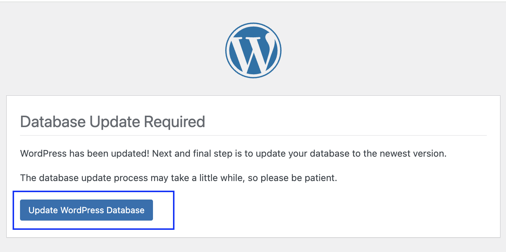
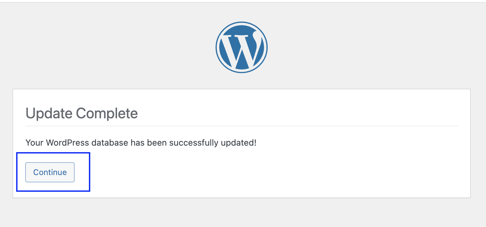
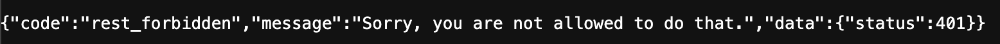
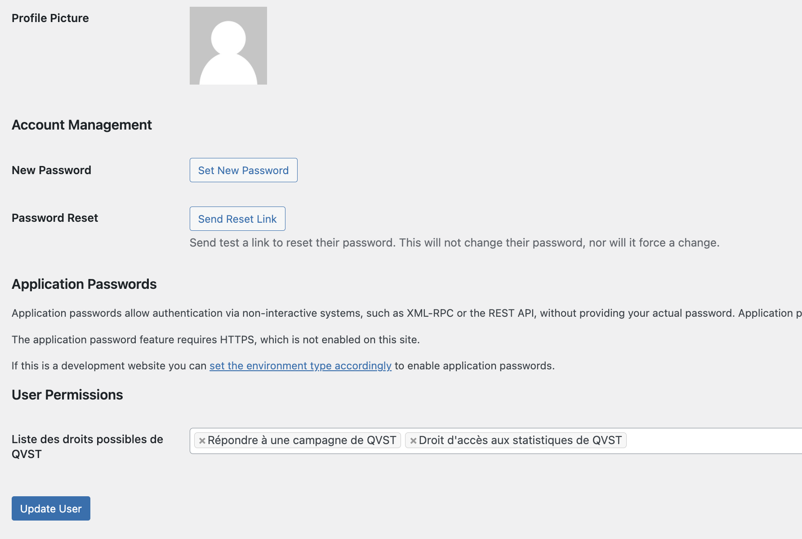

# xpeapp_backend

## Getting started

To run the project, you need to have the following installed:

- PHP
- Docker
- Composer

You also need to have a `.env` file in the root directory of the project. You can copy the `.env.example` file and rename it to `.env`.

You need `0001_dump.sql` and `init.sql` for the first data initialization. To do this, refer to an administrator.

## Run the project on local mode

Make sure to define **FORCE_SSL_ADMIN** to false in the _wordpress_ service of the `docker-compose.yml`. Make this prevent the automatic redirection to https when you use the backend admin panel.

Now, you can run the following commands to start the project (you need to be in the root directory of the project):

```bash
docker compose build
docker compose up -d
```

After running the above commands, you can access the project at `http://localhost:7830/wp-admin` and click on the 'Update database' button to update the database.


After that, you can access to the 'Continue' button to continue the installation of the project.


Now, you can login to the WordPress admin panel with the following credentials (if you are on local mode):

- Username: `wordpress_dev`
- Password: `wordpress_dev`

If you want to make an edit and restart the project, you can run the following commands:

```bash
docker compose down
docker compose build
docker compose up -d
```

> [!WARNING]  
> Make sure to remove the docker volumes depending your editions.

## Test the project

To verify that the backend works, you can go to the navigator and type the following URL: `http://localhost:7830/wp-json/xpeho/v1/qvst/campaigns`. You should see a JSON like this :



Indeed for the most part of endpoints, you need to send a Bearer token in the header. You can get the token by sending a POST request to the `http://localhost:7830/wp-json/jwt-auth/v1/token` endpoint with the following body (if you are on local mode):

```json
{
  "username": "wordpress_dev",
  "password": "wordpress_dev"
}
```

> [!NOTE]
> The token is valid for a month.

You copy the token field and paste it in the header of the request as follows:

```json
{
  "Authorization": "Bearer {token}"
}
```

## Deploy the project online

After every merge to the main branch, a docker image will be created in packages, you can see it on the package section at the right of the code page of the repository.

Now you can pull the docker image (on your server for instance) using :

```shell
docker pull ghcr.io/xpeho/wordpress:latest
```

Make sure to be logged in to ghcr.io with docker following the [documentation](https://docs.github.com/en/packages/working-with-a-github-packages-registry/working-with-the-container-registry#authenticating-with-a-personal-access-token-classic).

Make also sure to edit the `docker-compose.yml` as needed for your server. For instance you should need to edit the way to get the image from docker file to "ghcr.io/xpeho/wordpress:latest". By the way you need to copy the edited `docker-compose.yml` on your server to start the container. Don't forget the sql files for the first initialization.

## Init the fields for the endpoint security

If you try to access the endpoint `http://localhost:7830/wp-json/xpeho/v1/campaign-progress?userId={userId}` with a token you can get a 403 error follow these instructions :

To fix this, you need to create increase rights of the user.

- Go to the WordPress admin panel and click on the 'Users' menu on the left sidebar;

- Go to the user you want to edit and click on edit;

- Add the needed rights to the user at the bottom of the page:
  

- Click on the 'Save Changes' button.

After that, you can access the endpoint `http://localhost:7830/wp-json/xpeho/v1/campaign-progress?userId={userId}` with the user id and the token in the header.
