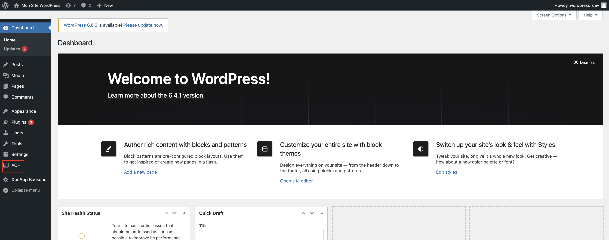
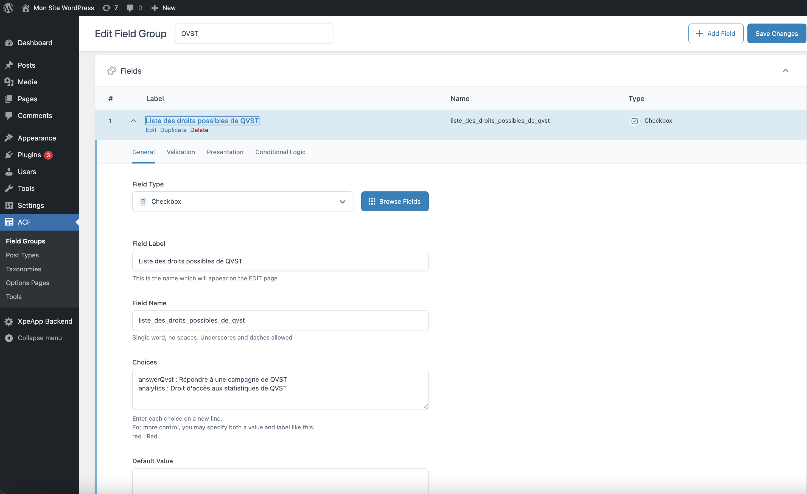

# xpeapp_backend

## Project setup

To run the project, you need to have the following installed:
- PHP
- Docker
- Composer

You also need to have a `.env` file in the root directory of the project. You can copy the `.env.example` file and rename it to `.env`.

You need 0001_dump.sql and init.sql for the first data intialization. To do this, you need to contact the administrator.

## Running the project
Now, you can run the following commands to start the project (you need to be in the root directory of the project):

```bash
sudo docker compose build
sudo docker compose up -d
```

After running the above commands, you can access the project at `http://localhost:8080/wp-admin` and click on the 'Update database' button to update the database.


After that, you can access to the 'Continue' button to continue the installation of the project.


Now, you can login to the WordPress admin panel with the following credentials (if you are in localhost):
- Username: `wordpress_dev`
- Password: `wordpress_dev`

If you want to restart the project, you can run the following commands:

```bash
sudo docker compose down
sudo docker compose build
sudo docker compose up -d
```

## Test the project

To verify, you can go to the navigator and type the following URL: `http://localhost:8080/wp-json/xpeho/v1/qvst/campaigns`. You should see a JSON response with the QVST campaigns.

For some endpoints, you need to send a Bearer token in the header. You can get the token by sending a POST request to the `http://localhost:8080/wp-json/jwt-auth/v1/token` endpoint with the following body:
```json
{
    "username": "wordpress_dev",
    "password": "wordpress_dev"
}
```
Note : the token is valid for 7 days.

You copy the token field and paste it in the header of the request as follows:
```json
{
    "Authorization": "Bearer {token}"
}
```

## Init the fields for the endpoint security

If you try to access the endpoint `http://localhost:8080/wp-json/xpeho/v1/campaign-progress?userId={userId}`, you get a 403 error.

To fix this, you need to create a new field in the user profile. To do this, you need to go to the WordPress admin panel and click on the 'ACF' menu.


Fill with the following information:


And click on the 'Save Changes' button.

Now, you can go to the 'Users' menu and select a user.
Add the following rights to the user:


After that, you can access the endpoint `http://localhost:8080/wp-json/xpeho/v1/campaign-progress?userId={userId}` with the user id and the token in the header.