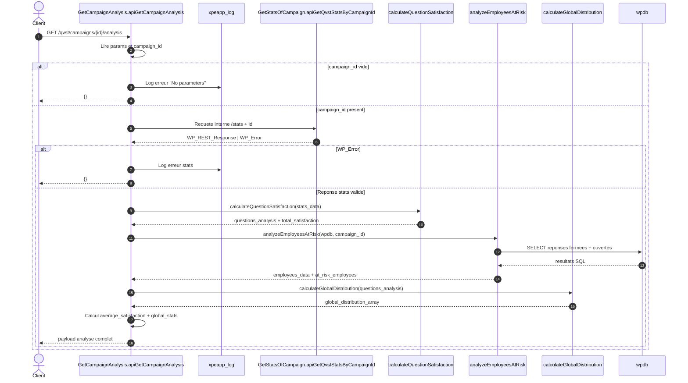
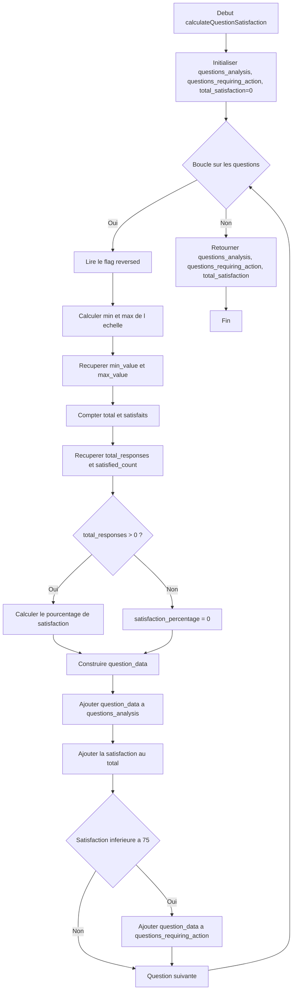

# GetCampaignAnalysis

## Objectif
La classe `GetCampaignAnalysis` construit une vue d'analyse complete d'une campagne QVST a partir des statistiques existantes et des reponses stockees.

Elle retourne :
- les stats globales de campagne (respondants, moyenne de satisfaction, besoin d'action)
- la satisfaction par question
- les questions qui necessitent une action
- la liste des collaborateurs anonymes a risque
- la distribution globale des scores

## Regles metier principales
- Une reponse est consideree comme **satisfaisante** si le score est `>= 4`.
- Une question est marquee **requires_action** si sa satisfaction est `< 75%`.
- Un collaborateur est **a risque** si sa satisfaction globale est `< 75%` et qu'il a au moins une reponse.
- Les questions inversees sont remappees avec la formule :
  - `valeur_normalisee = max + min - valeur`

## Flux general
1. L'API recoit l'identifiant de campagne.
2. Elle appelle `GetStatsOfCampaign::apiGetQvstStatsByCampaignId` pour recuperer les stats brutes.
3. Elle calcule la satisfaction par question.
4. Elle analyse les repondants a risque via les tables SQL de reponses.
5. Elle calcule la distribution globale des scores.
6. Elle assemble la reponse finale JSON.

## Diagramme de sequence (Mermaid)

## Diagramme de l'algorithme `calculateQuestionSatisfaction` (Mermaid)
