# Diagramme de Séquence - Analyse de Campagne QVST

## 1️⃣ Diagramme de Séquence Principal - Requête Complète

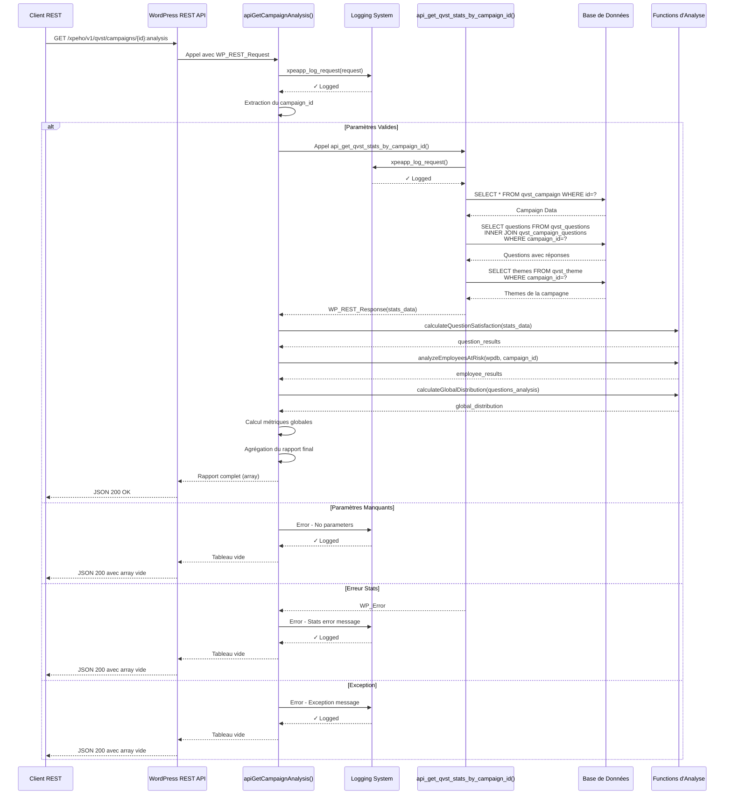

---

## 2️⃣ Diagramme Détaillé - calculateQuestionSatisfaction()

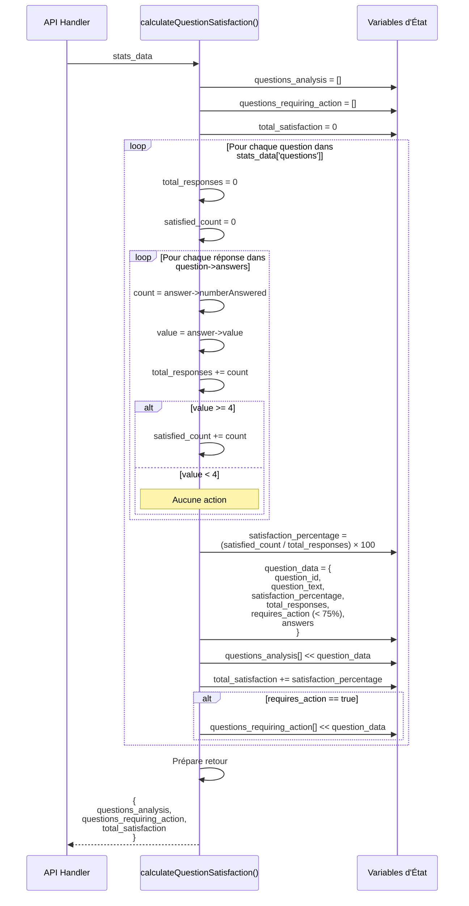

---

## 3️⃣ Diagramme Détaillé - analyzeEmployeesAtRisk()

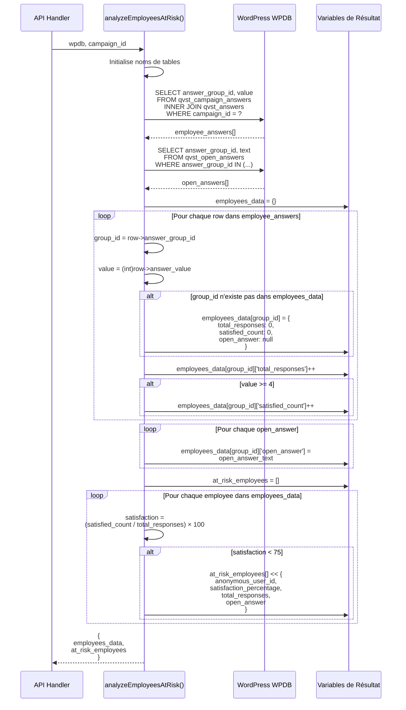

---

## 4️⃣ Diagramme Détaillé - calculateGlobalDistribution()

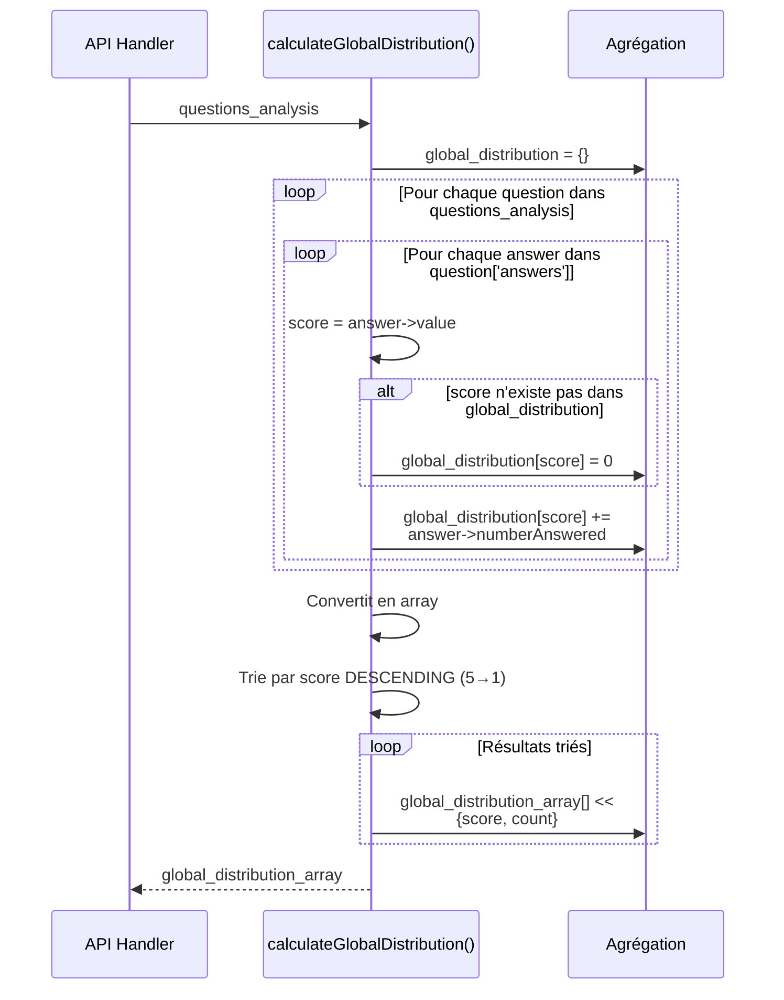

---

## 5️⃣ Flux Complet d'Agrégation - apiGetCampaignAnalysis()

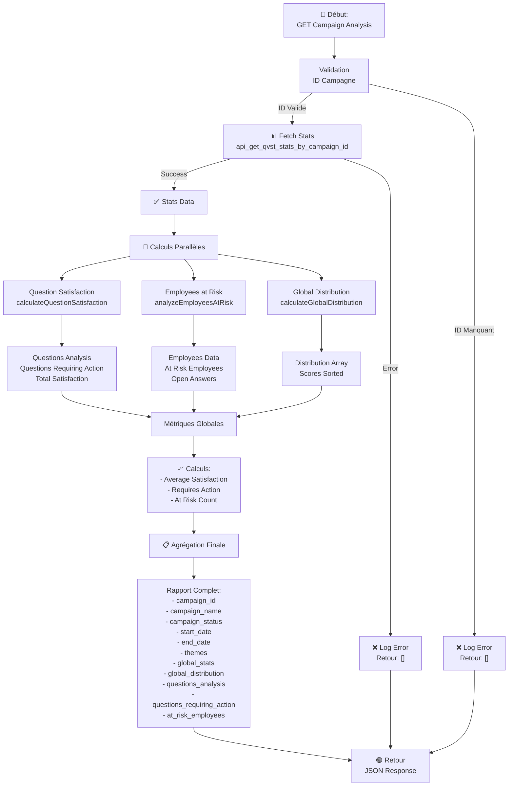

---

## 6️⃣ Diagramme États - Question

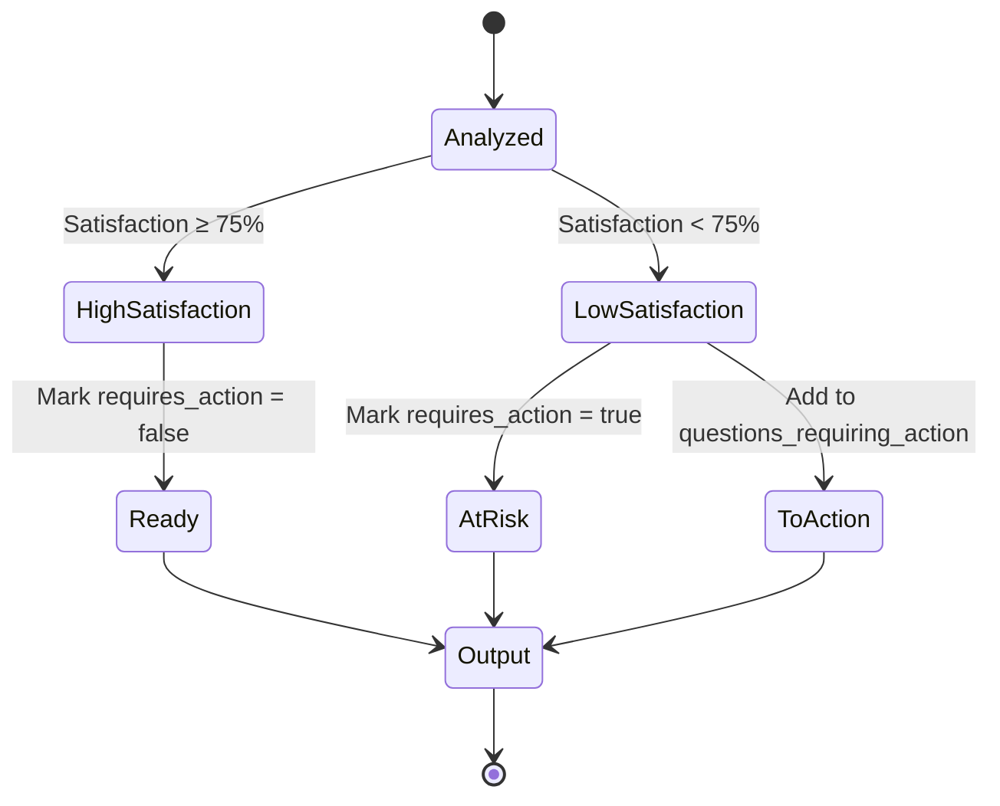

---

## 7️⃣ Diagramme États - Employé

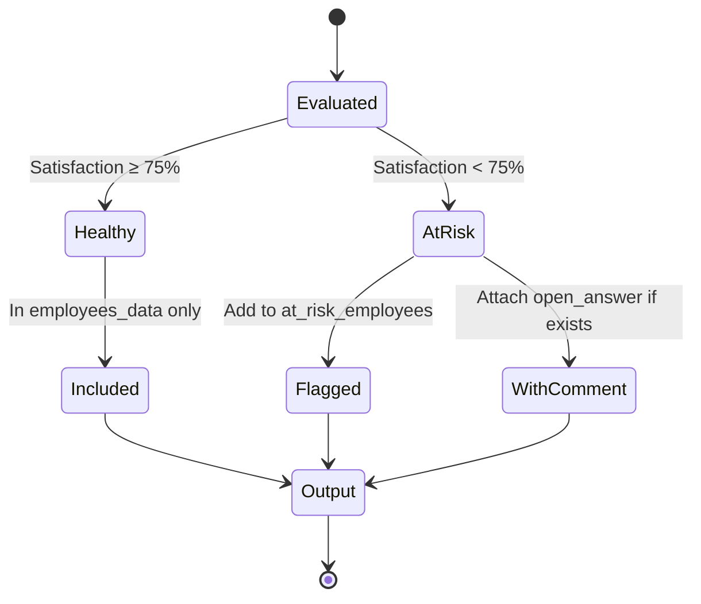

---

## 8️⃣ Flux de Données - Structure

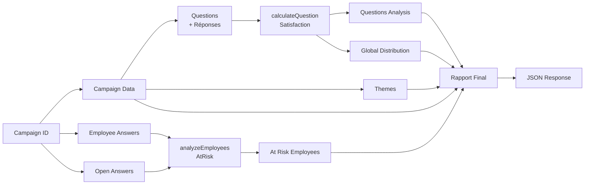

---

## 9️⃣ Matrice de Dépendances

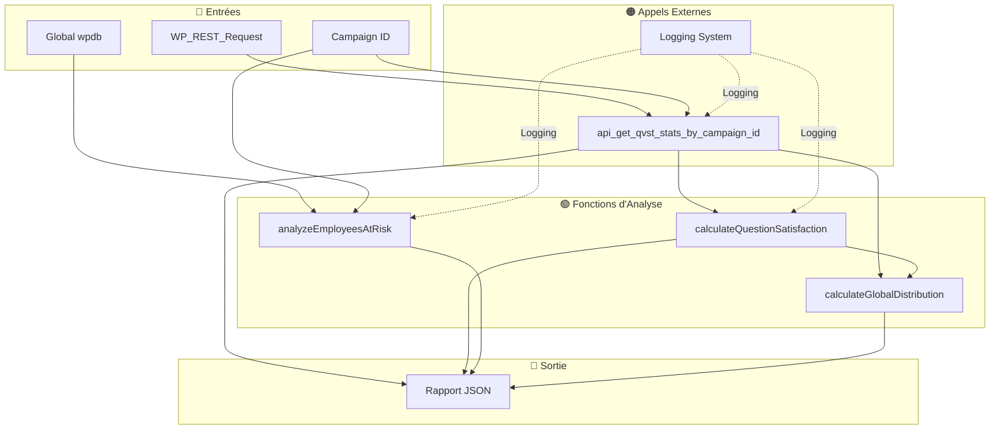

---

## 🔟 Timeline d'Exécution - Performance

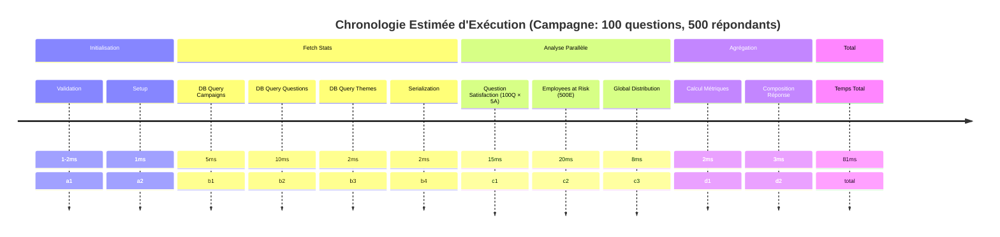

---

## 1️⃣1️⃣ Cas d'Erreur - Flow Diagramme

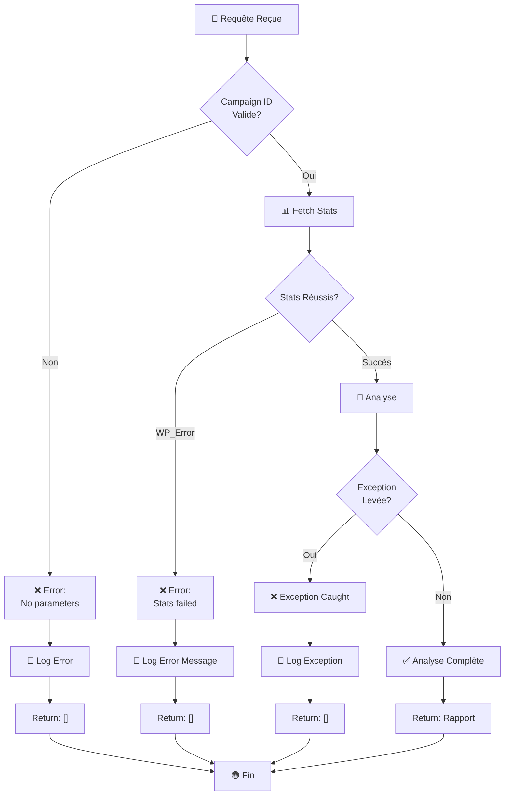

---

## 1️⃣2️⃣ Exemple Visuel - Satisfaction Calculation

```
Question: "Êtes-vous satisfait de votre environnement?"
─────────────────────────────────────────────────────

Réponses Reçues:
┌─────┬──────────┬───────────┐
│Score│Description │Nombre   │
├─────┼──────────┼───────────┤
│  5  │ Très bien  │ 45 votes │
│  4  │ Bien       │ 35 votes │
│  3  │ Moyen      │ 15 votes │ ─────┐
│  2  │ Mauvais    │ 10 votes │      │ Pas de satisfaction
│  1  │ Très mal   │  5 votes │ ─────┘
└─────┴──────────┴───────────┘

Calcul:
──────
Total réponses       = 45 + 35 + 15 + 10 + 5 = 110
Satisfaites (≥4)     = 45 + 35 = 80
Pourcentage          = (80 / 110) × 100 = 72.73%

Résultat:
─────────
Satisfaction:        72.73%
Requires Action:     TRUE (< 75%)

Statut:  🟠 ALERTE - Action requise
```

